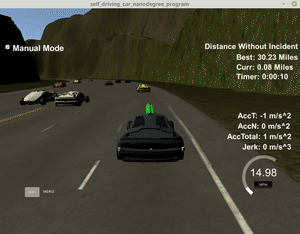

# About

### Problem

Plan a suitable path for the car driving the highway. Suitable means:

- Drive the car within the speed, acceleration and jerk limits
- Overtake slow vehicles by changing lanes
- Do not crash into other cars

You are given the waypoints of each lane center and information about the other cars (position and speed).

### Solution approach

The solution can be split into two separate modules:

- A path planner deals with driving the car within the speed, acceleration and jerk limits. It does not set the acceleration and steering angle (as you might expect), but directly outputs the (x,y,t) coordinates, to which the car is "teleported" to. Smooth trajectories are generated by fitting a spline to the start and target coordinates. Moreover, the velocity of the car in front of the egovehicle is taken into account.
- A behavior planner decides whether to keep the current lane, change to the right lane or change to the left lane. Therefore, a cost is calculated for each of these three options, which takes into account feasibility, safety and efficiency.

### Result

The solution passed the test successfully, please see my [detailed report](report.md).

# FAQ

See detailed instructions in original [original README.org](README_org.md)

### How to install

- Get term3-simulator from https://github.com/udacity/self-driving-car-sim/releases/tag/T3_v1.2
- Install required websocket library via `install-ubuntu.sh`
- Build project, e.g. via cmake + make

### How to run

- Run `build/path_planning`
- Start term3-simulator
  - Select "Project 1: Path Planning"
  - Start simulation
